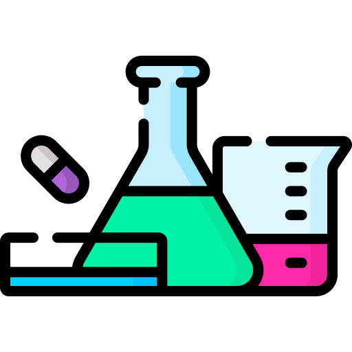
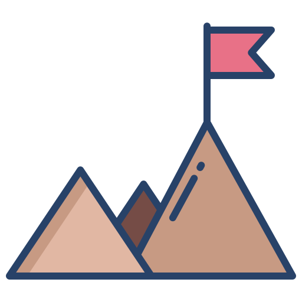

<h1 align="center"> Hello , my name is Hoàng </h1>

<h3 align="center">A passionate developer from Vietnam </h3>

<!---->
<!--### Hello , my name is Hoàng-->

- 👨‍🎓 I am a student at [UET-VNU](https://uet.vnu.edu.vn/).  
- 👨🏻 I'm currently learning new things and I would love to engage in any project
<!-- - 📫 You can find me at:

### Contributions 📈

  
  
  
  

 
  
  -->

#  Github Stats
   
  

    
    
     
    <b>Note:</b> Top languages is only a metric of the languages my public code consists of and doesn't reflect experience or skill level.
  

----

#  My Projects
<!--
##  Deep Learning:

  
 Click to expand 
 
📌 [**Dec 2022**]: Wav2Vec2 Research and Finetuning
  * Research and finetuning Wav2Vec2 on Vietnamese speech recognition task.
  * [Github Repo](https://github.com/hoang1007/wav2vec2.git)
📌 [**Dec 2022**]: Centernet Object as Points Research and Implementation
  * Code and research Centernet Object as Points.
  * [Github Repo](https://github.com/hoang1007/centernet.git)
📌 [**Jul 2022 - Aug 2022**]: Faster R-CNN Research and Implementation
  * Code and research Faster R-CNN algorithm.
  * [Github Repo](https://github.com/hoang1007/faster-rcnn.git)
📌 [**Feb 2022 - Mar 2022**]: Research about Transformer
  * Research about Transformer and finetuning BERT on downstream tasks:
    * [Question Answering](https://colab.research.google.com/drive/1_FxW1zIzwP6BEqVjdM4a-EtOh7mub75n?usp=sharing)
    * [Vietnamese Sentiment Analysis](https://colab.research.google.com/drive/11YDAMwxvxBVCmEELrI8K8B6EPeeVvOoT?usp=sharing)
    * [English - Vietnamese Translation](https://github.com/hoang1007/transformer-translator.git)
    * [Vietnamese Named Entity Recognition](https://colab.research.google.com/drive/1Co7nBt0R9h8paspo6ENy3sWNou2jjw_7?usp=sharing) 

-->

--------
##  Software:

  
Click to expand

📌 [**May 2021 - Advanced Programming**]:
  * Web 3.0 coswarm, owallet.
  * [Github Repo](https://github.com/johnhoangsoftware/agriorai.git)
<!--
📌 [**Sep 2021**]:
  * Build a Discord Bot which playing music and providing memes.
  * [Github Repo](https://github.com/hoang1007/gideon.git) 
-->

--------

#  My Assignments

  
Click to expand

📌 [**May 2021 - Advanced Programming**]:
  * Game SpaceShooter.
  * [Github Repo](https://github.com/johnhoangsoftware/BigGame.git)

📌 [**Oct 2021 - Object Oriented Programming**]:
  * A Dictionary App which can translate from speech, image using JavaFx
  * [Github Repo](https://github.com/johnhoangsoftware/dictionary-oop/tree/graphic)

📌 [**Dec 2021 - Object Oriented Programming**]:
  * A Bomberman Game using JavaFx
  * [Github Repo](https://github.com/johnhoangsoftware/bomberman)

📌 [**Dec 2021 - Database**]:
  * Website Whatever coffee
  * [Github Repo](https://github.com/johnhoangsoftware/front-end-whatever-coffee)

📌 [**Dec 2022 - Web**]:
  * Website Aladin
  * [Github Repo](https://github.com/hanzomaster/aladin)

📌 [**May 2023 - Mobile**]:
  * Mobile app Myhealth
  * [Github Repo](https://github.com/johnhoangsoftware/my-health)

<!-- 
#  Competitions

  
Click to expand

📌 [**Jul 2022 - Sep 2022**]:
  * 5th at Air Quality Forecasting Challenge AI4VN.
  * [Github Repo](https://github.com/hoang1007/air-quality-forecasting/tree/hoangv3)

 -->

#  Connect with me

	
	
	
	
	

 
  
    

